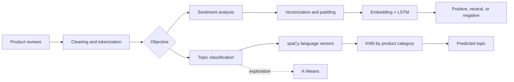

# LSTM for Topic Classification

A minimal, reproducible pipeline for classifying product reviews into four topics: `smartphone`, `television`, `refrigerator`, and `washing_machine`.

## Solution design



## How it works

1. Loads and validates labeled reviews from a CSV file.
2. Normalizes the text and creates a stratified train/test split.
3. Learns the vocabulary with `TextVectorization`.
4. Trains an `Embedding -> LSTM -> Dense -> Softmax` network.
5. Evaluates accuracy and produces sample predictions.

All reusable logic lives in `.py` files; the notebook only configures, runs, and presents the result.

## Project structure

```text
.github/workflows/pipeline.yml     automated GitHub Actions execution
data/topic_samples.csv             synthetic, balanced, PII-free data
notebooks/topic_classification_pipeline.ipynb
src/topic_classifier/              pipeline functions
```

## Run locally

Requires Python 3.12.

```bash
python -m venv .venv
source .venv/bin/activate           # Windows: .venv\Scripts\activate
python -m pip install -r requirements.txt
python -m jupyter nbconvert --execute --to notebook --inplace notebooks/topic_classification_pipeline.ipynb
```

The executed notebook retains metrics and predictions in its output cells.

## GitHub Actions

The `pipeline.yml` workflow runs on every push, pull request, or manual dispatch. It:

- installs the environment;
- validates Python module syntax;
- executes the notebook from start to finish;
- uploads the executed notebook as a workflow artifact.

The included dataset is synthetic and intended for demonstration. For real use, replace `data/topic_samples.csv` with labeled, PII-free data while preserving the `text` and `topic` columns.
