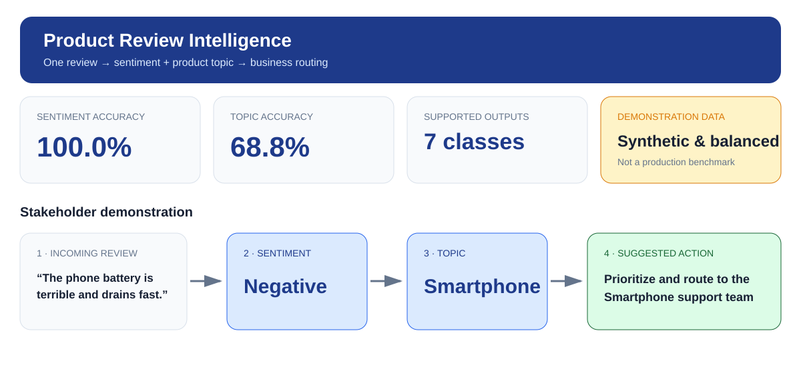
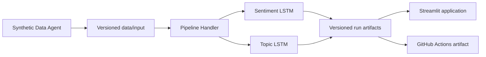

# LSTM Product Review Intelligence

A small software application that trains two LSTM classifiers and presents their results in Streamlit:

- sentiment: `positive`, `neutral`, or `negative`;
- topic: `smartphone`, `television`, `refrigerator`, or `washing_machine`.



## Solution design



`PipelineHandler` is the single execution boundary. It controls incremental data generation, model training, evaluation, inference, model persistence, and artifact publication. Every review has a stable ID, an explicit `train` or `test` type, and a versioned input timestamp.

## Dashboard

The application provides sentiment and topic distributions, word clouds, model metrics, confusion matrices, review-level predictions, suggested actions, and live classification with the persisted models.

Word clouds communicate frequency only. They do not represent feature importance or causality.

## Run locally

Python 3.12 is required.

```bash
python -m venv .venv
source .venv/bin/activate            # Windows: .venv\Scripts\activate
python -m pip install -e ".[test]"
lstm-pipeline train --run-id local-demo --epochs 20
streamlit run streamlit_app.py
```

Open `http://localhost:8501` after Streamlit starts.

### Handler commands

```bash
# Rebuild the initial 1,000-row input snapshot
lstm-pipeline generate-data --mode initialize --overwrite

# Append one batch: 100 train reviews and 100 test reviews
lstm-pipeline generate-data --mode append

# Train from existing versioned input without generating data
lstm-pipeline train --run-id my-run --epochs 20

# Append one batch, train both classifiers, and publish one run
lstm-pipeline run --append-data --run-id demo-run --epochs 20
```

## Data and artifacts

```text
data/
|-- input/
|   |-- input_manifest.json
|   |-- sentiment_samples.csv
|   |-- topic_samples.csv
|   `-- reviews.csv
`-- output/
    `-- <run_id>/
        |-- run_manifest.json
        |-- results.json
        |-- evaluation_predictions.csv
        |-- predictions.csv
        `-- models/
            |-- sentiment.keras
            `-- topic.keras
```

`reviews.csv` starts with 1,000 rows: 500 train and 500 test. `sentiment_samples.csv` and `topic_samples.csv` are aligned projections of the same IDs.

The final `predictions.csv` contains test rows only:

```text
ID, text, expected_sentiment, expected_topic, predicted_sentiment,
predicted_topic, type, input_timestamp, model_timestamp
```

`data/input` is versioned in Git. `data/output` is generated, ignored by Git, and uploaded by GitHub Actions. Every completed run records input hashes, execution parameters, runtime versions, timestamps, metrics, predictions, and trained models.

## Synthetic Data Agent

The local agent is configured in `config/synthetic_data.json`. It combines English phrase libraries without calling an external service. New rows receive contiguous monotonic IDs and the experiment timestamp. The data is synthetic and contains no personal information.

Use `lstm-pipeline train` when replacing the synthetic files with reviewed real-world inputs.

## Project structure

```text
.github/workflows/pipeline.yml        validation and versioned experiment workflow
config/synthetic_data.json            synthetic-data agent configuration
data/input/                           versioned train/test inputs
data/output/                          ignored, versioned run directories
src/lstm_for_the_win/agents/          incremental synthetic-data generation
src/lstm_for_the_win/classification/  reusable LSTM implementation
src/lstm_for_the_win/dashboard/       dashboard data, charts, and inference
src/lstm_for_the_win/handler.py       controlled application entry point
streamlit_app.py                      stakeholder-facing application
tests/                                data, artifact, visualization, and app tests
```

## GitHub Actions

The manually dispatched pipeline is the controlled data-producing experiment. Every execution:

1. appends exactly 100 train and 100 test reviews;
2. assigns contiguous IDs and the workflow timestamp;
3. trains and evaluates both classifiers;
4. verifies the datasets and final CSV schema;
5. commits the new input batch to `main`;
6. uploads the complete run as a downloadable artifact.

A separate read-only validation workflow runs on pushes and pull requests without generating data. This avoids an endless workflow/commit loop while keeping every execution of the data pipeline incremental.

The included results are a software demonstration, not a production benchmark. Production use requires representative data, privacy review, confidence calibration, acceptance thresholds, and model monitoring.
