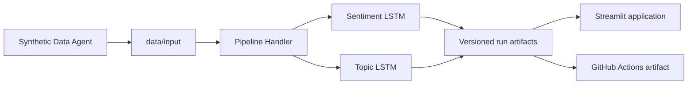

# LSTM Product Review Intelligence

A small software application that trains two LSTM classifiers and presents their results in Streamlit:

- sentiment: `positive`, `neutral`, or `negative`;
- topic: `smartphone`, `television`, `refrigerator`, or `washing_machine`.


## Solution design



`PipelineHandler` is the single execution boundary. It controls synthetic-data generation, model training, evaluation, inference, model persistence, and run publication. The Streamlit application reads completed artifacts and never retrains a model during a page refresh.

## Dashboard

The one-page application provides:

- total review volume, negative share, top topic, and low-confidence volume;
- predicted sentiment percentages and topic volumes;
- confidence distributions;
- filterable word clouds and precise top-term rankings;
- review-level predictions and suggested routing actions;
- training curves, holdout accuracy, and confusion matrices;
- live classification with probabilities from both persisted models.

Word clouds communicate frequency only. They do not represent feature importance or causality.

## Run locally

Python 3.12 is required.

```bash
python -m venv .venv
source .venv/bin/activate            # Windows: .venv\Scripts\activate
python -m pip install -e ".[test]"
lstm-pipeline run --epochs 20
streamlit run streamlit_app.py
```

Open `http://localhost:8501` after Streamlit starts.

### Handler commands

```bash
# Regenerate only the synthetic input datasets
lstm-pipeline generate-data --overwrite

# Train from existing input datasets without regenerating them
lstm-pipeline train --run-id my-run --epochs 20

# Regenerate synthetic input, train both classifiers, and publish one run
lstm-pipeline run --run-id demo-run --epochs 20
```

## Data and artifacts

```text
data/
├── input/
│   ├── input_manifest.json
│   ├── sentiment_samples.csv
│   ├── topic_samples.csv
│   └── reviews.csv
└── output/
    └── <run_id>/
        ├── run_manifest.json
        ├── results.json
        ├── evaluation_predictions.csv
        ├── inference_predictions.csv
        └── models/
            ├── sentiment.keras
            └── topic.keras
```

`data/input` contains reproducible, PII-free synthetic demonstration data and is versioned. `data/output` is generated, ignored by Git, and published by GitHub Actions as a downloadable workflow artifact.

Every completed run records its input hashes, execution parameters, Python and TensorFlow versions, creation timestamp, Git commit, metrics, predictions, and trained models.

## Synthetic Data Agent

The local agent is configured in `config/synthetic_data.json`. It uses seeded phrase libraries to create balanced English datasets without calling external services. This keeps continuous integration deterministic, avoids API credentials, and prevents accidental use of personal information.

Use `lstm-pipeline train` instead of `run` when replacing the synthetic files with reviewed real-world inputs.

## Project structure

```text
.github/workflows/pipeline.yml        continuous integration workflow
config/synthetic_data.json            synthetic-data agent configuration
data/input/                           versioned demonstration inputs
data/output/                          ignored, versioned run directories
src/lstm_for_the_win/agents/          synthetic-data generation
src/lstm_for_the_win/classification/  reusable LSTM implementation
src/lstm_for_the_win/dashboard/       dashboard data, charts, and inference
src/lstm_for_the_win/handler.py       controlled application entry point
streamlit_app.py                      stakeholder-facing application
tests/                                data, visualization, and app tests
```

## GitHub Actions

The workflow runs on pushes, pull requests, and manual dispatches. It:

1. installs the package;
2. generates deterministic synthetic input;
3. trains and evaluates both classifiers through the handler;
4. verifies that generated input matches the committed snapshot;
5. runs automated dashboard and live-inference tests;
6. starts the Streamlit server and checks its health endpoint;
7. uploads the complete run directory as `software-demonstration`.

The included results are a software demonstration, not a production benchmark. Production use requires representative data, privacy review, confidence calibration, acceptance thresholds, and model monitoring.
