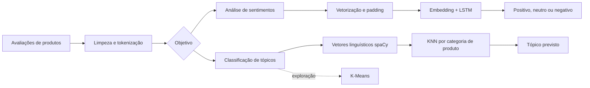

# LSTM para classificação de tópicos

Pipeline mínimo e reproduzível para classificar avaliações de produtos em quatro tópicos: `smartphone`, `televisao`, `refrigerador` e `maquina_de_lavar`.

# Design da solução



# Como funciona

1. Carrega e valida avaliações rotuladas em CSV.
2. Normaliza os textos e cria uma divisão estratificada de treino e teste.
3. Aprende o vocabulário com `TextVectorization`.
4. Treina uma rede `Embedding -> LSTM -> Dense -> Softmax`.
5. Avalia a acurácia e produz previsões de exemplo.

Toda a lógica está em arquivos `.py`; o notebook apenas configura, executa e apresenta o resultado.

# Estrutura

```text
.github/workflows/pipeline.yml     execução automática no GitHub Actions
data/topic_samples.csv             dados sintéticos, balanceados e sem PII
notebooks/topic_classification_pipeline.ipynb
src/topic_classifier/              funções do pipeline
```

# Executar localmente

Requer Python 3.12.

```bash
python -m venv .venv
source .venv/bin/activate           # Windows: .venv\Scripts\activate
python -m pip install -r requirements.txt
python -m jupyter nbconvert --execute --to notebook --inplace notebooks/topic_classification_pipeline.ipynb
```

O notebook executado mantém as métricas e previsões em suas células de saída.

## GitHub Actions

O workflow `pipeline.yml` executa em cada `push`, pull request ou acionamento manual. Ele:

- instala o ambiente;
- valida a sintaxe dos módulos;
- executa o notebook do início ao fim;
- publica o notebook executado como artefato da execução.

O conjunto incluído é demonstrativo e sintético. Para uso real, substitua `data/topic_samples.csv` por dados rotulados e sem informações pessoais, mantendo as colunas `text` e `topic`.
