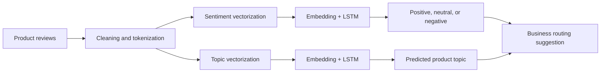

# LSTM for Sentiment and Topic Classification

A minimal, reproducible project with two product-review classifiers:

- sentiment: `positive`, `neutral`, or `negative`;
- topic: `smartphone`, `television`, `refrigerator`, or `washing_machine`.


## Solution design



The two classifiers share one reusable implementation but learn independent vocabularies and model weights.

## Stakeholder demonstration

The executed notebook includes a presentation-ready dashboard with:

- executive accuracy, evaluation-volume, and supported-class indicators;
- training-accuracy curves for both models;
- class-distribution comparisons;
- sentiment and topic confusion-matrix heatmaps;
- prediction examples with expected class, predicted class, confidence, and review status;
- a business demonstration that applies both classifiers to the same review;
- per-class confidence profiles and an illustrative routing suggestion;
- a visible warning that synthetic results are not production benchmarks.

Edit the `demo_reviews` tuple in the notebook to demonstrate different product reviews. GitHub Actions publishes both the executed notebook and a standalone HTML report as workflow artifacts.

## How it works

1. Loads and validates the sentiment and topic datasets.
2. Normalizes text and creates stratified train/test splits.
3. Learns an independent vocabulary for each task with `TextVectorization`.
4. Trains an `Embedding -> LSTM -> Dense -> Softmax` network for each classifier.
5. Evaluates both classifiers and produces sample predictions.

All reusable logic lives in `.py` files; the notebook only configures, runs, and presents the result.

## Project structure

```text
.github/workflows/pipeline.yml     automated GitHub Actions execution
data/sentiment_samples.csv         synthetic sentiment data
data/topic_samples.csv             synthetic topic data
notebooks/text_classification_pipeline.ipynb
docs/assets/stakeholder_overview.svg
src/text_classifier/               shared LSTM implementation
src/sentiment_classifier/          sentiment entry point
src/topic_classifier/              topic entry point
```

## Run locally

Requires Python 3.12.

```bash
python -m venv .venv
source .venv/bin/activate           # Windows: .venv\Scripts\activate
python -m pip install -r requirements.txt
python -m jupyter nbconvert --execute --to notebook --inplace notebooks/text_classification_pipeline.ipynb
```

The executed notebook retains metrics and predictions in its output cells.

To generate a standalone stakeholder report after executing the notebook:

```bash
python -m jupyter nbconvert --to html --no-input --no-prompt --output stakeholder_report.html notebooks/text_classification_pipeline.ipynb
```

## GitHub Actions

The `pipeline.yml` workflow runs on every push, pull request, or manual dispatch. It:

- installs the environment;
- validates Python module syntax;
- executes the notebook from start to finish;
- exports a standalone stakeholder HTML report;
- uploads the executed notebook and HTML report as workflow artifacts.

The included datasets are synthetic and intended for demonstration. For real use, replace them with labeled, PII-free data while preserving the `text` and `label` columns.
